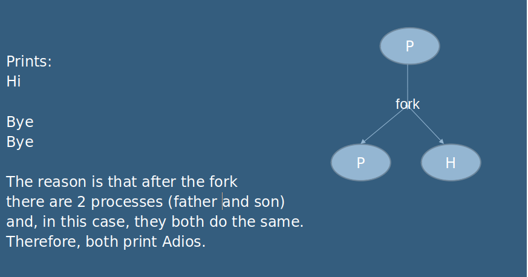

# Lab Introduction to Processes

##  1.- Given the following program, explain what it prints on the screen and state the reason :

````
int main () {

  int a=3,pid;

  printf ("Hi\n");

  pid=fork();

  printf ("Bye\n");

}
````
---




##  2.- Write a C program that creates two processes:

parent and child. Both will print “I am the father” or “I am the son””, as the case may be, and at the end they will print Bye and his pid and his father's
pid.

Important: the father should get some sleep to give the child time to finish and see the pid well. 

What happens if it doesn't go to sleep?

##  3.- Explain the behaviour of the following program. How many times appears each word?

````
main (){

  printf ("Hi\n");

  fork ();

  printf ("One\n");

  fork ();

  printf ("Two pid=%d\n",getpid());

}
````

Which order could they appear?

---


An execution example:

``
Hi
One
One
Two pid=12009
Two pid=12011
Two pid=12010
Two pid=12012
``

````
The reason is that every time a fork () is made, two processes appear. 
Therefore after the first fork () there are 2 processes, 
which also fork (), resulting in 4 processes (22).

SO:
Hi appears one time
One appears 2 times
Two appears 4 times

 The order may vary depending on the order of execution of the processes in each case,
 which depends on the system scheduler.
 It is recommended to run the example several times to test it
````

##  4.- When you execute the following program, how many time will you see "I am son n" ? 

State your answer

````

main () {

  int i,pid;

  for (i=1; i<=2; i++){

    pid = fork();

    if ( pid==0) {

      printf ("I am the son %d\n", i);

      exit(0); }

  }
}

````
---

````
Output of execution:
 
I am the child 1
I am the child 2
 
The reason is that although 2 fork () are made, in each case only runs a child process. 

And this one does not fork () because it prints a message and ends with exit (). 
````

##  5

### 5.1- Write a C program that creates a child program that executes a command received as an argument. The father ends up without doing more.

###  5.2- Modify the program so that the child writes the command output to a file instead of to the screen.

##  6

###  6.1- Write a program that creates 5 children.

###  6.2- modify it to create 5 children and 3 grandchildren.


